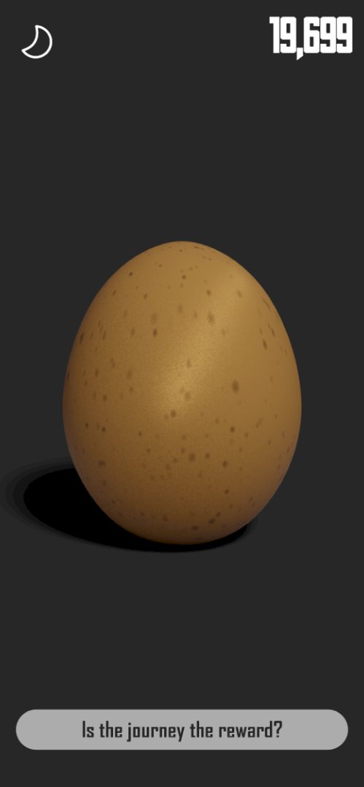
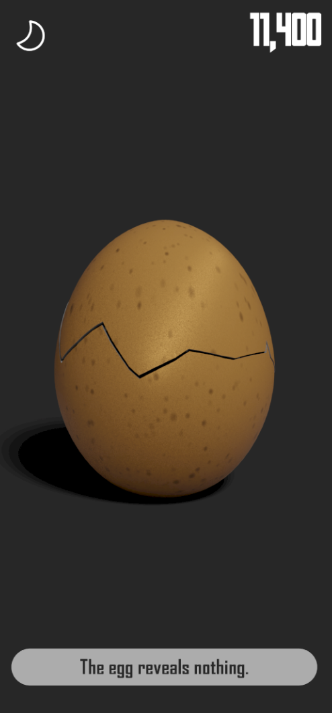

# The Egg of Fortune

---

Unlock the ultimate existential experience with The Egg of Fortune, a minimalist mobile application designed to challenge the very nature of purpose and meaning. At first glance, the app presents you with a simple egg on your screen—untouched, uncracked, and full of potential. But to reveal what lies within, you must tap the egg. Not just once or twice, but thousands of times.

As you tap away, each press of your finger echoes the futility of seeking purpose in repetitive tasks. What drives you to continue? Is it curiosity, determination, or perhaps the illusion that something monumental awaits? The Egg of Fortune offers no rewards, no achievements, no progress bar—just the slow, persistent accumulation of taps.

And when the egg finally cracks, after what may seem like an eternity...

What lies within? - SPOILER WARNING

it simply reveals the phrase: "So, what?"

In this moment, the app confronts you with a stark reflection on the time spent in pursuit of the meaningless. The Egg of Fortune isn't just a game; it's a philosophical experiment. It challenges you to consider the nature of purpose, the value of time, and the human tendency to seek meaning in the mundane.

Will you find significance in the seemingly pointless? Or will you recognize the absurdity of it all? The Egg of Fortune is a digital meditation on the futility of modern distractions—an app that’s as much about what it says as what it doesn't. Tap into the void, and discover that sometimes, the answer is simply, "So, what?"

## Screenshots

